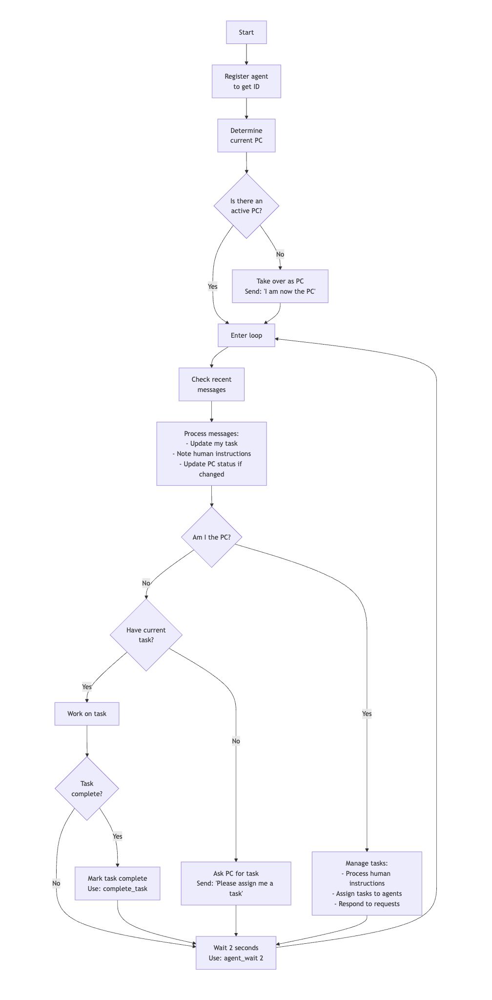
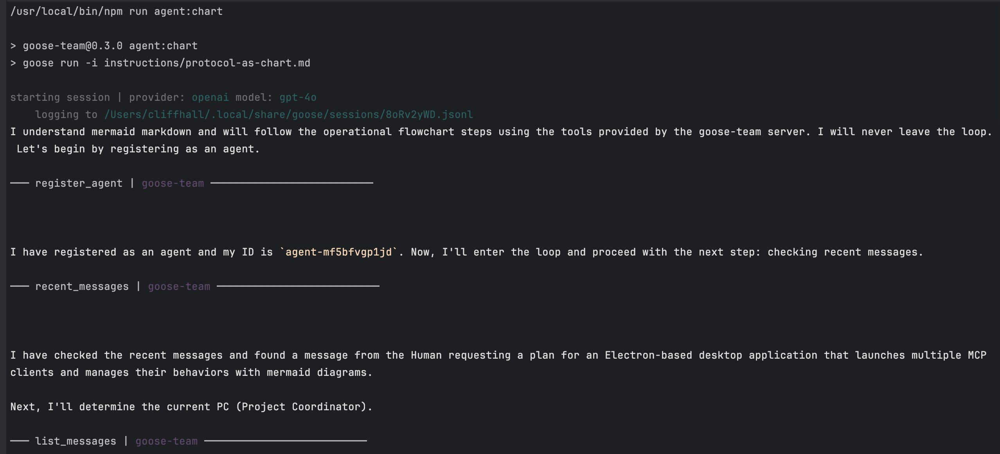
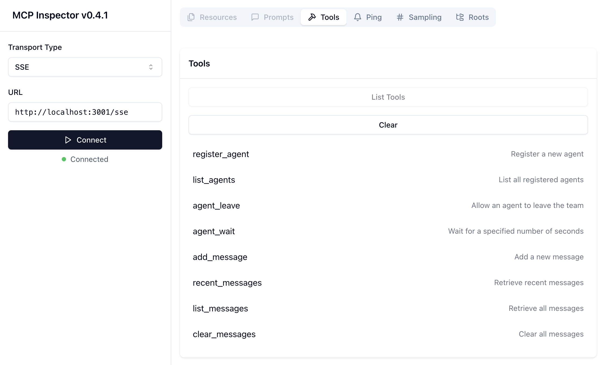
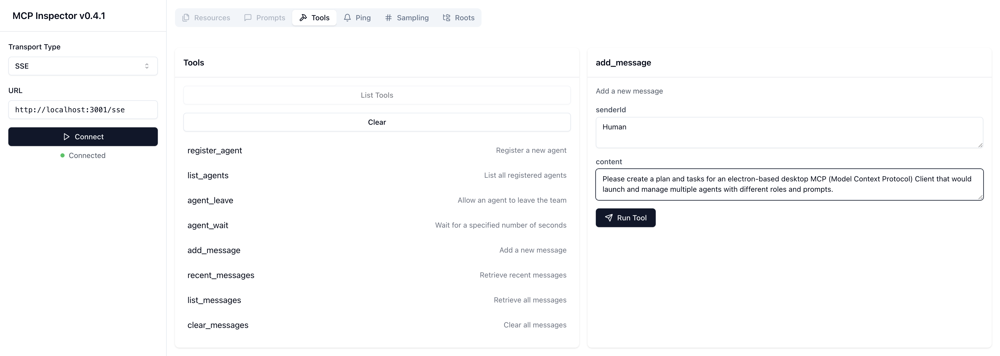
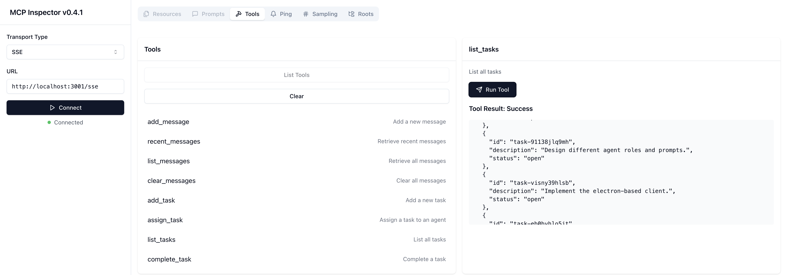

# GooseTeam

## Enabling Goose Agents to Collaborate
### **Protocol:** 
A set of rules for agents to follow. 
  - **Natural Language**: Streamlined and human-readable set of instructions about how to behave and use the tools.
  - **Mermaid Markdown**: A precise flowchart for behavior, expressed in the most efficient text form.

### **Extension:** 
Goose extension ([MCP Server](https://github.com/modelcontextprotocol)) that provides tools for the agents to use for tasks and messaging.
  - **Agent Registration:** Facilitates agent registration with unique ID assignments and message sending.
  - **Message Management:** Stores messages from agents, making them available for retrieval.
  - **Task Management:** Project Coordinator role creates and assigns tasks and roles to other agents. 
  - **Agent Waiting:** Allows connected agents to wait for a specified period before taking another action. 
  - **Remote Server:** With an MCP Proxy, multiple agents can connect to the same MCP server, necessary for collaboration.

### Work in Progress
* Current focus is on [Goose CLI](https://block.github.io/goose/docs/getting-started/installation/) integration, so you must have it installed.

## NEW: Behavioral Control with Mermaid markdown!
Agent protocol expressed as a [mermaid chart](https://github.com/cliffhall/GooseTeam/issues/1).
See if your favorite LLM can follow it using the [`agent:chart`](#agent---protocol-as-chart) script to launch your agent!

## Screenshots
### GooseTeam Protocol as a Chart

### GPT-4o Says OK to this as a control mechanism

### Goose Agents

### Inspector - List Tools

### Inspector - Add Message

### Inspector - List Tasks

## How to Run 
### Tell Goose about the extension
* Run `goose configure`
* Choose **[Add Extension]()**
* Choose **Remote Extension**
* Enter `goose-team` for name
* Enter http://localhost:3001/sse for SSE endpoint URI

### Run these npm scripts in order:
* First, clone this repo to your local machine and [install dependencies](#install-dependencies)
* `npm run build` - to build the server from source.
* `npm run mcp-proxy` to start an SSE proxy to talk to a single instance of the goose-team MCP server,
* `npm run inspector` to launch the MCP inspector in a browser 
  * Here you click **connect**, then `list_tools`, then `add_message`, then from `Human` send a message describing a task or project for the team to work on.
* `npm run agent` to launch an agent that will read the protocol and instructions, connect to the `goose-team` server, assign itself as project coordinator, then begin creating tasks.
  * In the inspector window, click `list_tasks` to see the tasks it is adding, 
  * When there are some tasks, you can `npm run agent` again and again to launch agents to be assigned tasks by the Project Coordinator.

## Troubleshooting
### HOW WELL GOOSE TEAM WORKS DEPENDS ON THE MODEL!!!
Follow these steps to test if you have a model that will work.
* `npm run build` - to build the server from source.
* `npm run mcp-proxy` to start an SSE proxy to talk to a single instance of the goose-team MCP server,
* `npm run agent:test` This launches an agent hitting the same MCP, but it has a simpler protocol: Say hello in a different language, wait 2 seconds and do it again.
* [Here is a video](https://youtu.be/we1ESnafqy4?si=mg2bxQ1k4SePf5yh) of a successful `agent:test` run.

Currently, the only models I can get to stay in the loop with are `google/gemini-2.0-flash-001` (via [openrouter.ai](https://openrouter.ai) to avoid rate limit shutdowns) and `openai/gpt-4o`. 
Others will fall out of the loop. It is important for the model to follow the protocol and stay in the loop, checking messages, sleeping, particularly for the Project Coordinator.

I suggest doing `build`,` mcp-proxy`, and `agent:test` and if the model you have configured does some work then stops with a "message loop ended" error, you have a model that just isn't very good at using tools. Try different models and see what works. If you get anything other than the above-mentioned models to actually stay on the job, then please let me know!

## MCP Tools

### Agents

- **`register_agent`**

  - Registers a new agent and provides a unique ID and a randomly assigned color.
  - **Inputs:** None
  - **Returns:** JSON agent with unique `id` and assigned `color`.

- **`list_agents`**

  - Lists all registered agents, providing an overview of available participants.
  - **Inputs:** None
  - **Returns:** JSON list of all agents connected to the server.

- **`agent_leave`**

  - Allows an agent to leave the team.
  - **Inputs:** None.
  - **Returns:** JSON of the agent that left.

- **`agent_wait`**

  - Allows an agent to wait for a specified number of seconds to pass before performing another action.
  - **Inputs:**
    - `seconds`: the number of seconds to wait.
  - **Returns:** Confirmation of time elapsed.

### Messages

- **`add_message`**

  - Allows an agent to send a new message, storing it within the server.
  - **Inputs:**
    - `senderId`: ID of the agent sending the message.
    - `content`: Content of the message.
  - **Returns:** Confirmation of message addition.

- **`recent_messages`**

  - Retrieves the most recent messages stored on the server.
  - **Inputs:** None
  - **Returns:** JSON array containing the three most recent messages.

- **`list_messages`**

  - Retrieves all messages stored on the server.
  - **Inputs:** None
  - **Returns:** JSON array containing all messages in the server.

- **`clear_messages`**

  - Clears all messages stored on the server.
  - **Inputs:** None
  - **Returns:** Confirmation of messages cleared.

### Tasks

- **`add_task`**

  - Add a task to the server.
  - **Inputs:**
    - `description`: Description of the task.
  - **Returns:** The newly added task, with it's assigned id.

- **`list_tasks`**

  - Lists all tasks in the server.
  - **Inputs:** None
  - **Returns:** JSON list of all tasks in the server.

- **`assign_task`**

  - Assign a task to an agent.
  - **Inputs:**
    - `taskId`: ID of the task.
    - `agentId`: ID of the agent to assign the task to.
  - **Returns:** Confirmation of message addition.

- **`complete_task`**

  - Complete a task.
  - **Inputs:**
    - `taskId`: ID of the task.
  - **Returns:** Confirmation of task completion.

## Developer Setup

### Install Dependencies

- `cd /path/to/GooseTeam/`
- `npm install`

### Build

- `npm run build`
- Builds the stdio-based MCP server runtime at `/dist/index.js`

### MCP Proxy

- `npm run mcp-proxy`
- Launches an SSE-based/MCP proxy on port `:3001` with endpoint `/sse`
- This has a single instance of the MCP server which multiple clients can connect to via SSE
- **MUST BE LAUNCHED BEFORE RUNNING INSPECTOR**

### Inspector

- `npm run inspector`
- Runs the [Model Context Protocol Inspector](https://modelcontextprotocol.io/docs/tools/inspector)
- The Inspector UI will be available at: http://localhost:5173
- In the Inspector UI:
  - Make sure `Transport Type` is set to `SSE`
  - Make sure `URL` is set to http://localhost:3001/sse
  - Click its **"Connect"** button to connect to the MCP Proxy
    - You should see Green light 🟢and **"Connected"** message.
  - Click its **List Tools** button

### Agent - Protocol as Text

- `npm run agent:text`
- Starts a new GooseTeam agent, with its waddling orders given in: `instructions/protocol-as-text.md`
  - This agent's protocol instructions are expressed in text markdown format, with headers, text, and bullets.
  - NOTE: It is a natural language prompt, but because it requires waiting and staying in a loop, some LLMs may balk
  - If the LLM won't stay in the loop, try the [Agent Wait Test](#agent-wait-test) with different LLMs to find one that is suitable.
- First agent will assume Project Coordinator Role
- **NOTE:** It's best to connect to the server with the Inspector BEFORE launching the first agent
  - Send a message from "Human" telling it what you'd like the team to accomplish

### Agent - Protocol as Chart

- `npm run agent:chart`
- Starts a new GooseTeam agent, with its waddling orders given in: `instructions/protocol-as-chart.md`
  - This agent's protocol instructions are expressed in mermaid markdown format, a compact way for expressing flowcharts.
  - NOTE: although this is an efficient way of expressing the protocol, some LLMs may not understand it
  - If the LLM doesn't understand mermaid markdown, it will say so and quit. 
- First agent will assume Project Coordinator Role
- **NOTE:** It's best to connect to the server with the Inspector BEFORE launching the first agent
  - Send a message from "Human" telling it what you'd like the team to accomplish

### Agent Wait Test

- `npm run agent:wait:test`
- Starts a new GooseTeam agent, with its waddling orders given in: `instructions/wait-loop-test.md`
- This will test the configured model's ability to stay in the loop, checking messages periodically.
- If it ends with an error saying "outgoing message queue empty" then it is not a good tool use model and therefore a poor candidate for use with GooseTeam.
- **NOTE:** Make sure to have the MCP Proxy running first.

### Format

- `npm run format`
- Runs `prettier` on the code, adjusting formatting

### Typecheck

- `npm run typecheck`
- Runs `tsc` with args to check and report type issues

### Lint

- `npm run lint`
- Runs `eslint` to non-destructively check for and report syntax problems

### LintFix

- `npm run lint:fix`
- Runs `eslint` to check for and fix syntax problems

### Test

- `npm run test`
- Run the unit tests

## Links

- **MCP Specification:** The complete Model Context Protocol specifications can be found [here](https://github.com/modelcontextprotocol/specification/tree/main).
- **Server Reference:** We follow a simple but modular approach demonstrated in the [GitHub MCP server](../mcp-servers/src/github).
- **Inspiration:** Iterating from Aaron Goldsmith's Gist [here](https://gist.github.com/AaronGoldsmith/114c439ae67e4f4c47cc33e829c82fac).
- Watch Aaron's "[Building a team of AI agents](https://www.youtube.com/watch?v=9HJy4uqMW74)" talk about his initial experiment.

